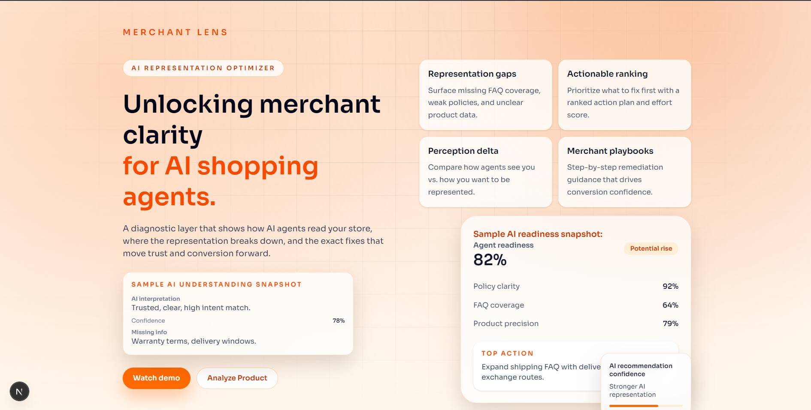
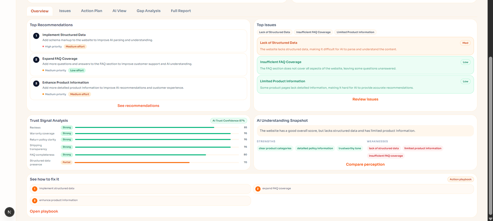

# Merchant Lens — AI Readiness Analyzer for E-commerce Stores




Merchant Lens is a Next.js web application that helps e-commerce merchants understand how AI shopping agents (like ChatGPT, Perplexity, and Google AI) perceive their store. It scores your store across five key dimensions, identifies gaps between how AI sees you vs. how you want to be seen, and generates a ranked action plan to improve your AI visibility.

## Demo Video

Watch the demo here:
https://www.youtube.com/watch?v=5og_wF8LpPU

---

## 📋 Table of Contents

- [Problem Statement](#problem-statement)
- [How It Works](#how-it-works)
- [Features](#features)
- [Tech Stack](#tech-stack)
- [Project Structure](#project-structure)
- [Prerequisites](#prerequisites)
- [Setup & Local Development](#setup--local-development)
- [Environment Variables](#environment-variables)
- [API Routes](#api-routes)
- [Available Models](#available-models)
- [Supported File Types](#supported-file-types)
- [Contributing](#contributing)

---

## 🧩 Problem Statement

AI-powered shopping assistants are now a primary discovery channel for online stores. When a customer asks ChatGPT or Perplexity "find me the best eco-friendly water bottle under $40," these agents scan, interpret, and rank stores based on the quality of their product data, trust signals, structured markup, and policy clarity.

Most merchants have no idea what AI agents think of their store, or why they're being overlooked in AI-generated recommendations.

**Merchant Lens solves this by:**

- Simulating how an AI agent reads and scores your store
- Surfacing the exact gaps between your intended brand positioning and what AI actually perceives
- Generating a prioritized, actionable fix plan so merchants know exactly what to improve first

---

## ⚙️ How It Works

1. **Input** — The merchant provides one or more of: a product description (text), a store URL, or an uploaded file (PDF, DOCX, image, etc.)
2. **Extraction** — If a file is uploaded, text is extracted server-side (or via Tesseract.js OCR for images)
3. **Analysis** — The combined input is sent to a Groq-hosted LLM which returns a structured `AnalysisResult` with scores, issues, recommendations, and gap data
4. **Report** — Results are displayed across six tabs (Overview, Issues, Action Plan, AI View, Gap Analysis, Full Report) and can be exported as Markdown, PDF, or JSON

---

## ✨ Features

### Core Analysis
| Feature | Description |
|---|---|
| **AI Readiness Score** | Overall 0–100 score with a label (Poor / Fair / Good / Excellent) |
| **Score Breakdown** | Five dimensions: Product Clarity, FAQ Coverage, Trust Signals, Policy Completeness, Structured Data |
| **AI Snapshot** | A plain-English paragraph describing how an AI agent currently reads the store |
| **Perceived Strengths & Weaknesses** | What AI recognises as positives and negatives |
| **Top Issues** | Categorised by severity (High / Med / Low) |
| **Ranked Action Plan** | Prioritised recommendations with effort ratings (Low / Medium / High) |
| **Gap Analysis** | Side-by-side view of AI perception vs. merchant intent, per dimension |
| **Fix Playbook** | Step-by-step numbered instructions to improve the score |
| **AI-Optimised Rewrite** | An AI-rewritten product description tuned for agent discoverability |

### Toolkit (Sidebar)
| Tool | Description |
|---|---|
| **Schema.org Generator** | Generates valid JSON-LD product schema from a description |
| **FAQ Builder** | Auto-generates an FAQ from a product description |
| **Trust Signal Checker** | Fetches a live URL and checks for trust signals (reviews, warranties, policies, contact info) |
| **Policy Analyzer** | Scores a pasted policy document across 8 sections |
| **Description Enhancer** | Rewrites a product description to score higher with AI agents |

### Export
- **Markdown** — Full `.md` report downloadable instantly
- **PDF** — Print-ready PDF via browser print dialog
- **JSON** — Raw `AnalysisResult` object for programmatic use
- **Copy to clipboard** — Markdown copied directly

### UX
- Analysis history stored in browser (localStorage), browsable and re-loadable
- Light / Dark / System theme with OS sync
- Collapsible sidebar
- Multi-input: combine description + URL + file in one analysis
- Persisted API key and model selection across sessions

---

## 🛠 Tech Stack

| Layer | Technology |
|---|---|
| Framework | [Next.js 16](https://nextjs.org) (App Router) |
| Language | TypeScript |
| Styling | Tailwind CSS |
| LLM Provider | [Groq](https://groq.com) (fast inference) |
| OCR | [Tesseract.js](https://tesseract.projectnaptha.com) (client-side, for image uploads) |
| Icons | [Lucide React](https://lucide.dev) |
| PDF Export | Browser `window.print()` via `pdfReport.tsx` |

---

## 📁 Project Structure

```
ai_representational_optimizer/
├─ .next/
├─ app/
│  ├─ analyze/
│  │  ├─ components/
│  │  │  ├─ AnalyzeHeader.tsx
│  │  │  ├─ ExportModal.tsx
│  │  │  ├─ FullReportSection.tsx
│  │  │  ├─ HistoryPanel.tsx
│  │  │  ├─ InputCard.tsx
│  │  │  ├─ OverviewTab.tsx
│  │  │  ├─ ScoreCard.tsx
│  │  │  ├─ Sidebar.tsx
│  │  │  ├─ SidebarPanels.tsx
│  │  │  ├─ TabViews.tsx
│  │  │  └─ ui.tsx
│  │  ├─ page.tsx
│  │  ├─ pdfReport.tsx
│  │  ├─ toolkit.tsx
│  │  ├─ types.ts
│  │  └─ utils.ts
│  ├─ api/
│  │  ├─ analyze/
│  │  │  └─ route.ts
│  │  ├─ analyze-file/
│  │  │  └─ route.ts
│  │  ├─ policy_analyze/
│  │  │  └─ route.ts
│  │  ├─ schema/
│  │  │  └─ route.ts
│  │  └─ trust_check/
│  │     └─ route.ts
│  ├─ favicon.ico
│  ├─ globals.css
│  ├─ layout.tsx
│  └─ page.tsx
├─ public/
│  ├─ file.svg
│  ├─ globe.svg
│  ├─ next.svg
│  ├─ vercel.svg
│  └─ window.svg
├─ screenshots/
│  ├─ dashboard.png
│  ├─ faqBuilder.png
│  ├─ fullReortTab.png
│  ├─ homePage.png
│  ├─ overview.png
│  └─ toolkit.png
├─ .env.local
├─ .gitignore
├─ AGENTS.md
├─ CLAUDE.md
├─ CONTRIBUTION_NOTE.md
├─ DECISION_LOG.md
├─ eslint.config.mjs
├─ next-env.d.ts
├─ next.config.ts
├─ package-lock.json
├─ package.json
├─ postcss.config.mjs
├─ PRODUCT_DOCUMENT.md
├─ product_document.pdf
├─ README.md
├─ TECHNICAL_DOCUMENT.md
├─ technical_document.pdf
└─ tsconfig.json

```

---

## ✅ Prerequisites

Before you start, make sure you have:

- **Node.js** v18.17 or later ([download](https://nodejs.org))
- **npm** v9+ or **yarn** or **pnpm**
- A **Groq API key** — free tier available at [console.groq.com](https://console.groq.com)

---

## 🚀 Setup & Local Development

### 1. Clone the repository

```bash
git clone https://github.com/your-org/merchant-lens.git
cd merchant-lens
```

### 2. Install dependencies

```bash
npm install
# or
yarn install
# or
pnpm install
```

### 3. Set up environment variables

Copy the example env file and fill in your values:

```bash
cp .env.example .env.local
```

Then open `.env.local` and add your Groq API key (see [Environment Variables](#environment-variables) below).

### 4. Run the development server

```bash
npm run dev
# or
yarn dev
# or
pnpm dev
```

Open [http://localhost:3000](http://localhost:3000) in your browser.

### 5. Navigate to the Analyze page

Go to [http://localhost:3000/analyze](http://localhost:3000/analyze) to use the tool.

---

### Production Build

```bash
npm run build
npm run start
```

---

## 🔑 Environment Variables

Create a `.env.local` file in the project root with the following:

```env
# ── Required ──────────────────────────────────────────────────────────────────

# Your Groq API key — get one free at https://console.groq.com
GROQ_API_KEY=gsk_xxxxxxxxxxxxxxxxxxxxxxxxxxxx


# ── Optional ──────────────────────────────────────────────────────────────────

# Default LLM model to use (can be overridden per-user in Settings)
# Options: llama-3.3-70b-versatile | llama-3.1-8b-instant | mixtral-8x7b-32768
GROQ_MODEL=llama-3.3-70b-versatile
```

> **Note:** Users can also enter their own Groq API key directly in the app's Settings panel. That key is stored in their browser's localStorage under `merchantlens_api_key` and takes priority over the server's environment variable.

---

## 🔌 API Routes

All routes accept and return JSON unless noted.

| Method | Route | Body | Description |
|---|---|---|---|
| `POST` | `/api/analyze` | `{ input, mode, model?, apiKey? }` | Main analysis — returns full `AnalysisResult` |
| `POST` | `/api/analyze-file` | `FormData: { file, model?, apiKey?, returnText }` | Extracts text from uploaded file |
| `POST` | `/api/schema` | `{ input }` | Generates Schema.org JSON-LD for a product |
| `POST` | `/api/trust_check` | `{ url }` | Fetches URL and checks for trust signals |
| `POST` | `/api/policy_analyze` | `{ policy }` | Scores a pasted policy document |

### `AnalysisResult` shape (returned by `/api/analyze`)

```ts
{
  overall_score: number;           // 0–100
  overall_label: string;           // "Poor" | "Fair" | "Good" | "Excellent"
  potential_lift: string;          // e.g. "+18–25 points"
  ai_snapshot: string;             // Plain-English AI perception paragraph
  score_breakdown: {
    product_clarity: number;
    faq_coverage: number;
    trust_signals: number;
    policy_completeness: number;
    structured_data: number;
  };
  perceived_strengths: string[];
  perceived_weaknesses: string[];
  top_issues: Issue[];             // { title, description, severity: "High"|"Med"|"Low" }
  top_recommendations: Recommendation[];
  ranked_action_plan: Recommendation[];  // { title, detail, priority, effort }
  fix_playbook: string[];
  comparison: {
    ai_perceives: string;
    merchant_intent: string;
    gaps: GapItem[];               // { dimension, ai_perceives, merchant_intent, gap_explanation }
  };
  rewritten_description?: string;
  input_consistency?: {
    consistencyLevel: "HIGH" | "MEDIUM" | "LOW";
    warning?: string;
  };
}
```

---

## 🤖 Available Models

The model can be selected in Settings (persisted to localStorage) or set via `GROQ_MODEL` in your `.env.local`.

| Model ID | Speed | Quality | Best for |
|---|---|---|---|
| `llama-3.3-70b-versatile` | Fast | High | Default — best balance |
| `llama-3.1-8b-instant` | Very fast | Moderate | Quick tests, lower cost |
| `mixtral-8x7b-32768` | Fast | High | Long-context inputs |

---

## 📎 Supported File Types

Files can be uploaded alongside (or instead of) a text description or URL.

| Type | Extensions | Extraction method |
|---|---|---|
| Documents | `.pdf`, `.docx`, `.txt` | Server-side text extraction |
| Spreadsheets | `.csv`, `.xlsx` | Server-side text extraction |
| Data | `.json` | Server-side text extraction |
| Images | `.png`, `.jpg`, `.jpeg`, `.webp` | Tesseract.js OCR (client-side) |

Maximum file size: **10 MB**

---

## 🤝 Contributing

1. Fork the repository
2. Create a feature branch: `git checkout -b feat/your-feature-name`
3. Commit your changes: `git commit -m "feat: add your feature"`
4. Push to the branch: `git push origin feat/your-feature-name`
5. Open a Pull Request

Please keep components focused — UI in `components/`, business logic in `page.tsx`, shared helpers in `utils.ts`.

## Additional Notes

- [Contribution Note](./CONTRIBUTION_NOTE.md)

---